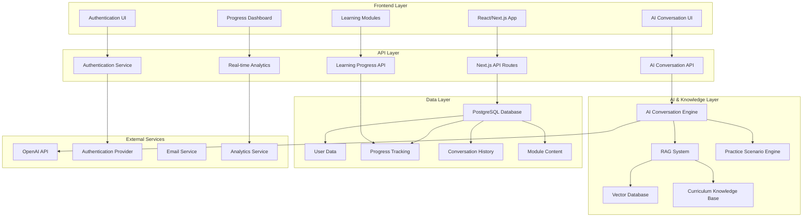
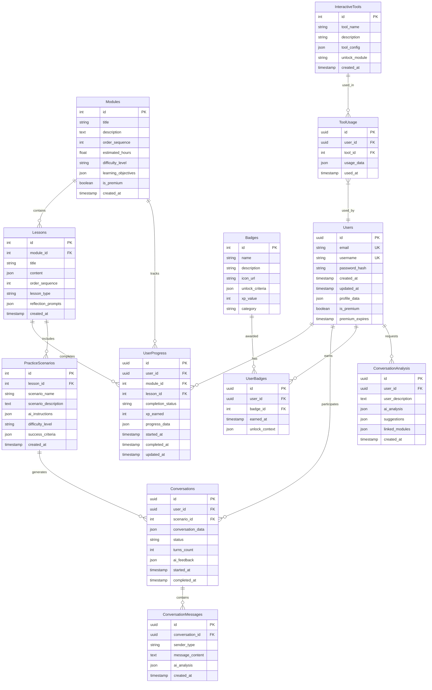
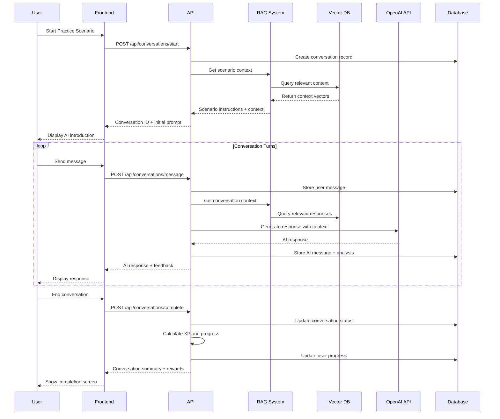
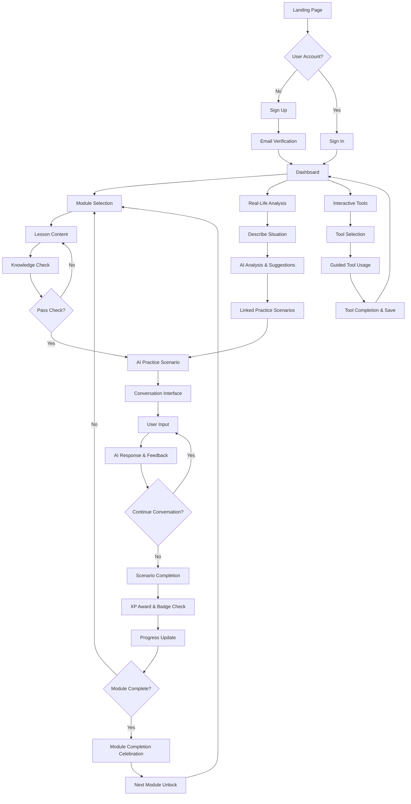
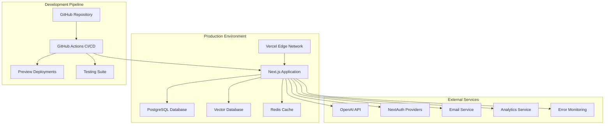

# Technical Specification Document
## Relational Life Practice AI Learning Platform

**Version**: 1.0  
**Date**: May 27, 2025  
**Author**: Rafael Hidalgo  
**Status**: Implementation Ready  
**Based on**: PRD v2.0 with Complete 12-Module Curriculum Architecture

---

## 🎯 **Executive Summary**

This Technical Specification Document (TSD) provides implementation-ready specifications for the Relational Life Practice AI Learning Platform - a sophisticated Duolingo-style application for teaching relationship skills through AI-powered conversations and evidence-based curriculum design.

### **Key Technical Achievements**
- **Strategic AI Consultation**: 12-module curriculum architecture via Custom GPT "Relational Learning Architect"
- **Advanced AI Integration**: RAG-enhanced conversational system with 15+ practice scenarios
- **Sophisticated Gamification**: Multi-tier progression system with 12 unique badges and interactive tools
- **Educational Technology**: Assessment framework supporting Recognition → Application → Transfer → Sustained Use

### **System Overview**
A React/Next.js web application with PostgreSQL database, vector-based RAG system, and OpenAI integration, designed for sub-2-second AI response times and 99.5% uptime at scale.

---

## 🏗️ **System Architecture Overview**

### **Architecture Principles**
- **Modularity**: Separate concerns for learning, AI, and user management
- **Scalability**: Stateless API design with horizontal scaling capability
- **Performance**: Optimized for <2 second AI response times
- **Security**: Multi-layer security with encrypted data and secure authentication
- **Maintainability**: Clean separation between presentation, business logic, and data layers

### **Technology Stack (Cost-Optimized)**
- **Frontend**: React 18 with Next.js 14 (App Router)
- **Backend**: Next.js API Routes with TypeScript
- **Database**: PostgreSQL 15+ with Prisma ORM
- **Vector DB**: Chroma (open-source) or Supabase Vector for RAG ($0-20/month vs $70 Pinecone)
- **AI Service**: Claude 3.5 Sonnet API (40% cost savings vs GPT-4, comparable performance)
- **Embeddings**: Voyage-3-lite or Jina v3 (80% cost savings vs OpenAI, superior performance)
- **Authentication**: NextAuth.js with multiple providers
- **Deployment**: Vercel with edge functions
- **Monitoring**: Vercel Analytics + Sentry error tracking

### **Cost Optimization Strategy**
**Estimated Monthly Savings**: 70%+ operational cost reduction
- **AI API**: Claude 3.5 Sonnet (~$15/1M tokens vs GPT-4 $25/1M) = 40% savings
- **Embeddings**: Voyage-3-lite (~$0.03/1M tokens vs OpenAI $0.13/1M) = 80% savings  
- **Vector Database**: Chroma ($0-10/month vs Pinecone $70/month) = 85%+ savings
- **Total Monthly Cost**: ~$30-80 vs ~$150-300 with premium providers


### **High-Level Architecture Diagram**



---

## 💾 **Database Design**

### **Database Schema Principles**
- **Normalized Structure**: Minimize data redundancy while optimizing for read performance
- **Flexible Progress Tracking**: JSON fields for extensible user progress data
- **Conversation History**: Complete interaction logs for AI improvement and user insights
- **Scalable Design**: UUID primary keys for distributed system compatibility
- **Performance Optimized**: Strategic indexes on high-query columns


### **Entity Relationship Diagram**



---

## 🤖 **AI Conversation Engine Specification**

### **AI Conversation Flow**




### **RAG System Architecture**

#### **Knowledge Base Components**
1. **Terry Real Corpus**: Complete books processed into semantic chunks
2. **Curriculum Content**: 12-module learning materials and examples
3. **Practice Scenarios**: 15+ detailed scenario descriptions with success criteria
4. **Interactive Tool Instructions**: Step-by-step guidance for Speech Builder, Apology Builder, etc.

#### **Vector Database Schema (Chroma/Supabase Optimized)**
```typescript
interface VectorDocument {
  id: string;
  content: string;
  metadata: {
    source: 'terry_real' | 'curriculum' | 'scenario' | 'tool';
    module_id?: number;
    scenario_id?: number;
    tool_name?: string;
    content_type: 'concept' | 'example' | 'instruction' | 'feedback';
    difficulty_level: 'beginner' | 'intermediate' | 'advanced';
  };
  embedding: number[]; // Voyage-3-lite or Jina v3 embeddings (1536 dimensions)
}
```

**Embedding Strategy (Cost-Optimized)**:
- **Primary**: Voyage-3-lite embeddings - Close to OpenAI performance for 1/5 the price
- **Alternative**: Jina v3 - Outperforms OpenAI on benchmarks, supports 89 languages
- **Fallback**: OpenAI ada-002 for critical scenarios requiring maximum compatibility
- **Cost Impact**: ~$15 vs $65 for processing Terry Real corpus (80% savings)

#### **AI Conversation Engine Specifications**

**Core Capabilities**:
- **Contextual Understanding**: Maintains conversation history and user progress context
- **Adaptive Responses**: Adjusts complexity based on user skill level and module progression
- **Skill Assessment**: Evaluates user responses for Recognition → Application → Transfer → Sustained Use
- **Crisis Detection**: Identifies distress signals and provides appropriate resources
- **Personalization**: Learns user communication patterns and provides tailored feedback

**AI Service Architecture (Cost-Optimized)**:
```typescript
interface AIServiceConfig {
  primaryModel: 'claude-3-5-sonnet'; // 40% cost savings vs GPT-4
  embeddingModel: 'voyage-3-lite' | 'jina-v3'; // 80% cost savings vs OpenAI
  vectorDatabase: 'chroma' | 'supabase-vector'; // 85%+ cost savings vs Pinecone
  fallbackModel: 'gpt-4o-mini'; // For high-complexity scenarios if needed
}
```

**AI Prompt Architecture**:
```typescript
interface AIPromptContext {
  systemRole: string; // Base RLT coach instructions optimized for Claude 3.5
  curriculumContext: string; // Current module/lesson context
  scenarioInstructions: string; // Specific practice scenario guidance
  userHistory: ConversationMessage[]; // Recent conversation history
  userProgress: UserProgressData; // Skill level and completed modules
  safetyInstructions: string; // Crisis detection and response protocols
}
```

**Cost-Performance Benefits**:
- **Claude 3.5 Sonnet**: Superior price/performance ratio, faster responses, excellent reasoning
- **Voyage-3-lite Embeddings**: Close to OpenAI v3-large performance for 1/5 the price
- **Chroma Vector DB**: Open-source, perfect for startup scale, minimal deployment costs

---

## 🎮 **Gamification System Architecture**

### **XP and Badge System**

#### **Multi-Tier XP Tracking**
```typescript
interface UserXP {
  totalXP: number;
  speakingXP: number;
  listeningXP: number;
  boundariesXP: number;
  repairXP: number;
  conflictMasteryXP: number;
}
```

#### **Complete Badge System** (12 Unique Achievements)
```typescript
interface Badge {
  id: number;
  name: string;
  description: string;
  category: 'foundation' | 'communication' | 'advanced' | 'integration';
  unlockCriteria: {
    moduleCompletion?: number[];
    xpThreshold?: number;
    scenarioSuccess?: string[];
    toolUsage?: string[];
    streakDays?: number;
  };
  xpValue: number;
  iconUrl: string;
}

// Example badges from PRD:
const badges: Badge[] = [
  {
    name: "Relational Rookie",
    description: "Completed Introduction to Relational Empowerment",
    category: "foundation",
    unlockCriteria: { moduleCompletion: [1] }
  },
  {
    name: "Truth Teller", 
    description: "Mastered assertive communication without harshness",
    category: "communication",
    unlockCriteria: { moduleCompletion: [6], scenarioSuccess: ["Speaking Assertively"] }
  },
  {
    name: "Cycle Breaker",
    description: "Demonstrated legacy healing and pattern interruption",
    category: "integration", 
    unlockCriteria: { moduleCompletion: [12], toolUsage: ["Legacy Map"] }
  }
];
```


### **Interactive Tools Specification**

#### **1. 5-Step Speech Builder** (Module 6)
```typescript
interface SpeechBuilderStep {
  step: 1 | 2 | 3 | 4 | 5;
  title: string;
  prompt: string;
  validation: (input: string) => boolean;
  examples: string[];
}

const speechBuilderSteps: SpeechBuilderStep[] = [
  { 
    step: 1, 
    title: "Share your experience", 
    prompt: "Describe what happened without blame or interpretation",
    validation: (input) => !containsBlameLanguage(input),
    examples: ["When you came home late...", "During our conversation yesterday..."]
  }
  // ... remaining 4 steps
];
```

#### **2. Apology Builder** (Module 8)
```typescript  
interface ApologyComponent {
  component: 'responsibility' | 'impact' | 'change' | 'amends';
  required: boolean;
  prompt: string;
  validation: (input: string) => { valid: boolean; feedback: string };
}
```

#### **3. Conflict Lab** (Module 10)
- **Adaptive Scenarios**: Difficulty scales based on user progress
- **Real-time Feedback**: AI analyzes emotional regulation and communication quality
- **Success Metrics**: Tracks de-escalation, empathy demonstration, resolution quality

#### **4. Legacy Map** (Module 12)
- **Generational Pattern Visualization**: Interactive family tree with relationship patterns
- **Pattern Breaking Tools**: Specific interventions for identified patterns
- **Progress Tracking**: Measures pattern interruption over time

#### **5. My Relational Plan** (Module 11)
- **Personalized Practice Schedule**: Daily/weekly relationship skill practice
- **Goal Setting**: Specific relationship improvement targets
- **Progress Review**: Regular assessment of real-world application

---

## 🎯 **User Journey & Experience Flow**

### **Complete User Journey**




### **User Experience Principles**
- **Progressive Disclosure**: Complex concepts introduced gradually across 12 modules
- **Immediate Feedback**: Real-time AI responses and skill assessment
- **Safe Practice Environment**: Non-judgmental space for emotional skill development
- **Personalized Learning**: Adaptive difficulty based on user progress and success
- **Intrinsic Motivation**: Meaningful badges and epic meaning (family transformation, legacy healing)

---

## 🔧 **Component Architecture**

### **React Component Hierarchy**

```mermaid
graph TB
    subgraph "Core Application"
        A[App Layout]
        B[Authentication Provider]
    end
    
    subgraph "Main Features"
        C[User Dashboard]
        D[Learning Module]
        E[AI Conversation]
        F[Interactive Tools]
        G[Progress Tracking]
    end
    
    subgraph "Dashboard Components"
        H[Module Grid]
        I[Progress Overview]
        J[Badge Collection]
        K[Recent Activity]
    end
    
    subgraph "Learning Components"
        L[Lesson Content]
        M[Knowledge Check]
        N[Reflection Prompts]
        O[Practice Scenario Launch]
    end
    
    subgraph "Conversation Components"
        P[Conversation Interface]
        Q[Message Input]
        R[AI Response Display]
        S[Conversation History]
        T[Feedback Panel]
    end
    
    subgraph "Interactive Tools"
        U[Speech Builder]
        V[Apology Builder]
        W[Conflict Lab]
        X[Legacy Map]
        Y[Relational Plan]
    end
    
    subgraph "Progress Components"
        Z[XP Visualization]
        AA[Badge Progress]
        BB[Module Completion]
        CC[Skill Assessment]
    end
    
    A --> B
    B --> C
    B --> D
    B --> E
    B --> F
    B --> G
    
    C -.-> H
    C -.-> I
    C -.-> J
    C -.-> K
    
    D -.-> L
    D -.-> M
    D -.-> N
    D -.-> O
    
    E -.-> P
    E -.-> Q
    E -.-> R
    E -.-> S
    E -.-> T
    
    F -.-> U
    F -.-> V
    F -.-> W
    F -.-> X
    F -.-> Y
    
    G -.-> Z
    G -.-> AA
    G -.-> BB
    G -.-> CC
```



### **Key Component Specifications**

#### **AIConversationEngine Component**
```typescript
interface AIConversationEngineProps {
  scenarioId: number;
  userProgress: UserProgressData;
  onComplete: (results: ConversationResults) => void;
}

interface ConversationState {
  messages: ConversationMessage[];
  isLoading: boolean;
  currentTurn: number;
  scenarioContext: ScenarioData;
  userSkillLevel: SkillLevel;
}
```

#### **ProgressTracker Component**
```typescript
interface ProgressTrackerProps {
  userId: string;
  currentModule: number;
  overallProgress: UserProgress;
}

interface ProgressState {
  xpByCategory: UserXP;
  unlockedBadges: Badge[];
  currentStreak: number;
  completionPercentage: number;
}
```

#### **InteractiveToolWrapper Component**
```typescript
interface InteractiveToolProps {
  toolType: 'speech-builder' | 'apology-builder' | 'conflict-lab' | 'legacy-map' | 'relational-plan';
  userContext: UserContext;
  onToolComplete: (toolResults: ToolResults) => void;
}
```

---

## 🔌 **API Specification**

### **Core API Endpoints**

#### **Authentication & User Management**
```typescript
// POST /api/auth/signup
interface SignupRequest {
  email: string;
  username: string;
  password: string;
}

// GET /api/users/profile
interface UserProfile {
  id: string;
  email: string;
  username: string;
  isPremium: boolean;
  createdAt: string;
  profileData: UserProfileData;
}

// PUT /api/users/profile
interface UpdateProfileRequest {
  username?: string;
  profileData?: Partial<UserProfileData>;
}
```

#### **Learning & Progress Management**
```typescript
// GET /api/modules
interface Module {
  id: number;
  title: string;
  description: string;
  estimatedHours: number;
  difficultyLevel: string;
  isUnlocked: boolean;
  userProgress: ModuleProgress;
}

// GET /api/modules/{id}/lessons
interface Lesson {
  id: number;
  moduleId: number;
  title: string;
  content: LessonContent;
  orderSequence: number;
  isCompleted: boolean;
  practiceScenarios: PracticeScenario[];
}

// POST /api/progress/lesson-complete
interface LessonCompleteRequest {
  lessonId: number;
  completionData: LessonCompletionData;
  reflectionResponses: string[];
}
```

#### **AI Conversation Management**
```typescript
// POST /api/conversations/start
interface StartConversationRequest {
  scenarioId: number;
  userContext: UserContext;
}

interface StartConversationResponse {
  conversationId: string;
  initialPrompt: string;
  scenarioInstructions: string;
}

// POST /api/conversations/{id}/message
interface SendMessageRequest {
  message: string;
  messageType: 'user' | 'system';
}

interface SendMessageResponse {
  aiResponse: string;
  feedback: AIFeedback;
  progressUpdate: ProgressUpdate;
  conversationContinues: boolean;
}

// POST /api/conversations/{id}/complete
interface CompleteConversationResponse {
  summary: ConversationSummary;
  xpEarned: number;
  badgesUnlocked: Badge[];
  skillAssessment: SkillAssessment;
}
```


#### **Real-Life Conversation Analysis**
```typescript
// POST /api/analysis/conversation
interface ConversationAnalysisRequest {
  userDescription: string;
  relationshipContext: string;
  challengeType: string;
}

interface ConversationAnalysisResponse {
  analysis: {
    identifiedPatterns: string[];
    rltConcepts: string[];
    improvementAreas: string[];
  };
  suggestions: {
    immediateTips: string[];
    practiceScenarios: PracticeScenario[];
    relevantModules: Module[];
  };
  linkedContent: {
    lessonRecommendations: Lesson[];
    toolRecommendations: InteractiveTool[];
  };
}
```

#### **Interactive Tools API**
```typescript
// POST /api/tools/speech-builder
interface SpeechBuilderRequest {
  stepData: SpeechBuilderStepData[];
  situationContext: string;
}

// GET /api/tools/user-saves
interface UserToolSaves {
  speeches: SavedSpeech[];
  apologies: SavedApology[];
  conflictPlans: SavedConflictPlan[];
  legacyMaps: SavedLegacyMap[];
  relationalPlans: SavedRelationalPlan[];
}
```

#### **Gamification & Progress API**
```typescript
// GET /api/progress/dashboard
interface ProgressDashboard {
  overallProgress: {
    totalXP: number;
    xpByCategory: UserXP;
    completedModules: number;
    currentStreak: number;
  };
  badges: {
    earned: Badge[];
    available: Badge[];
    nextUnlock: Badge;
  };
  recentActivity: ActivityItem[];
  upcomingMilestones: Milestone[];
}

// POST /api/badges/check-unlock
interface BadgeUnlockCheck {
  userId: string;
  triggerEvent: 'lesson_complete' | 'conversation_complete' | 'tool_usage' | 'streak_milestone';
  eventData: any;
}
```

---

## 🛡️ **Security & Privacy Specifications**

### **Data Protection**
- **Encryption**: AES-256 encryption for all sensitive data at rest
- **Transport Security**: TLS 1.3 for all API communications
- **API Security**: JWT tokens with short expiration and refresh token rotation
- **Input Validation**: Comprehensive sanitization of all user inputs
- **SQL Injection Prevention**: Parameterized queries and ORM usage

### **Privacy Controls**
```typescript
interface PrivacySettings {
  dataRetention: {
    conversationHistory: '30days' | '90days' | '1year' | 'indefinite';
    analyticsData: '6months' | '1year' | '2years';
    accountData: 'active_only' | 'indefinite';
  };
  datasharing: {
    anonymizedAnalytics: boolean;
    researchParticipation: boolean;
    marketingCommunications: boolean;
  };
  rightToDelete: {
    requestDeletion: () => Promise<DeletionConfirmation>;
    exportData: () => Promise<UserDataExport>;
  };
}
```

### **Crisis Detection & Safety**
```typescript
interface CrisisDetection {
  keywords: string[]; // Suicide, self-harm, abuse indicators
  severityLevels: 'low' | 'medium' | 'high' | 'critical';
  responseProtocols: {
    low: 'gentle_check_in';
    medium: 'resource_offering';
    high: 'immediate_resources';
    critical: 'emergency_protocol';
  };
  resources: {
    nationalSuicidePreventionLifeline: '988';
    crisisTextLine: 'HOME to 741741';
    domesticViolenceHotline: '1-800-799-7233';
    emergencyServices: '911';
  };
}
```


---

## 🚀 **Deployment Architecture**

### **Deployment Strategy**



### **Infrastructure Specifications**

#### **Production Environment (Cost-Optimized)**
- **Platform**: Vercel Pro with Edge Functions
- **Database**: Supabase PostgreSQL with vector extensions (includes vector database capability)
- **Vector Storage**: Chroma (self-hosted) or Supabase Vector (integrated)
- **Caching**: Redis for session and API response caching
- **CDN**: Vercel Edge Network for global content delivery
- **Monitoring**: Vercel Analytics + Sentry for error tracking

#### **Cost-Optimized Infrastructure**
```typescript
interface CostOptimizedStack {
  aiService: {
    primary: 'claude-3-5-sonnet';
    cost: '$15/1M tokens';
    savings: '40% vs GPT-4';
  };
  embeddings: {
    primary: 'voyage-3-lite';
    cost: '$0.03/1M tokens';
    savings: '80% vs OpenAI';
  };
  vectorDatabase: {
    primary: 'chroma' | 'supabase-vector';
    cost: '$0-20/month';
    savings: '85%+ vs Pinecone';
  };
  totalMonthlyCost: '$30-80 vs $150-300';
  totalSavings: '70%+';
}
```

#### **Performance Targets**
```typescript
interface PerformanceTargets {
  pageLoadTime: '<2 seconds';
  aiResponseTime: '<2 seconds';
  uptime: '99.5%';
  databaseQueryTime: '<100ms average';
  concurrentUsers: '1000+ supported';
  scalability: 'horizontal scaling ready';
}
```

#### **Environment Configuration**
```typescript
interface EnvironmentConfig {
  production: {
    DATABASE_URL: string;
    VECTOR_DB_URL: string;
    OPENAI_API_KEY: string;
    NEXTAUTH_SECRET: string;
    REDIS_URL: string;
    SENTRY_DSN: string;
  };
  development: {
    // Similar structure with dev values
  };
  testing: {
    // Test environment configuration
  };
}
```

---

## ⚡ **Performance Requirements**

### **Response Time Specifications**
- **Page Load**: <2 seconds for initial page render
- **AI Conversations**: <2 seconds for AI response generation
- **Database Queries**: <100ms average response time
- **Interactive Tools**: <500ms for tool state updates
- **Progress Updates**: <300ms for XP and badge calculations

### **Scalability Requirements**
- **Concurrent Users**: Support 1000+ simultaneous users
- **Database Connections**: Connection pooling for efficient resource usage
- **API Rate Limits**: 100 requests per minute per user
- **Cache Strategy**: Redis caching for frequently accessed data
- **CDN Usage**: Global content delivery for static assets

### **Optimization Strategies**
```typescript
interface OptimizationStrategy {
  frontend: {
    codesplitting: 'Dynamic imports for route-based splitting';
    imageOptimization: 'Next.js Image component with WebP/AVIF';
    bundleAnalysis: 'Webpack Bundle Analyzer for optimization';
    lazyLoading: 'React.lazy for component-level splitting';
  };
  backend: {
    databaseIndexing: 'Strategic indexes on high-query columns';
    queryOptimization: 'N+1 query prevention with proper joins';
    caching: 'Redis for session and API response caching';
    connectionPooling: 'PostgreSQL connection pool management';
  };
  ai: {
    responseStreaming: 'Stream AI responses for perceived performance';
    contextCaching: 'Cache frequently used RAG contexts';
    promptOptimization: 'Minimize token usage while maintaining quality';
  };
}
```


---

## 📋 **Implementation Phases**

### **Phase 1: Core Foundation (Week 2)**
**Duration**: 5-7 days  
**Deliverables**: Basic application structure with authentication and database

#### **Technical Tasks**
1. **Project Setup**
   - Next.js 14 application with TypeScript
   - PostgreSQL database with Prisma ORM
   - NextAuth.js authentication setup
   - Basic UI components and routing

2. **Database Implementation**
   - Complete schema creation and migrations
   - Seed data for modules and initial content
   - User management and authentication flows

3. **RAG System Foundation**
   - Vector database setup (Pinecone/Supabase)
   - Terry Real content processing and embedding
   - Basic retrieval and context generation

**Success Criteria**: User can signup, login, and view curriculum structure

### **Phase 2: AI Conversation Engine (Week 3)**
**Duration**: 7-10 days  
**Deliverables**: Working AI practice conversations with basic scenarios

#### **Technical Tasks**
1. **AI Integration**
   - OpenAI API integration with context management
   - Conversation flow implementation
   - Basic practice scenarios (5+ scenarios)

2. **Learning Module Implementation**
   - Priority modules (1, 4, 6, 8) content delivery
   - Lesson progression and knowledge checks
   - Basic progress tracking

3. **Interactive Tools Foundation**
   - Speech Builder basic implementation
   - Tool usage tracking and save functionality

**Success Criteria**: Users can complete lessons and engage in AI practice conversations

### **Phase 3: Gamification & Polish (Week 4)**
**Duration**: 5-7 days  
**Deliverables**: Complete gamification system and production-ready application

#### **Technical Tasks**
1. **Complete Gamification**
   - XP system implementation
   - Badge unlock mechanics
   - Progress visualization and achievements

2. **Advanced Features**
   - Real-life conversation analysis
   - Complete interactive tools suite
   - Advanced AI scenarios (15+ total)

3. **Production Readiness**
   - Performance optimization
   - Security audit and implementation
   - Error handling and monitoring setup

**Success Criteria**: Full MVP with complete user journey and gamification

---

## 🧪 **Testing Strategy**

### **Testing Pyramid**
```typescript
interface TestingStrategy {
  unitTests: {
    coverage: '80%+';
    tools: 'Jest + React Testing Library';
    focus: 'Component logic, utility functions, API handlers';
  };
  integrationTests: {
    coverage: 'Critical user flows';
    tools: 'Playwright or Cypress';
    focus: 'AI conversations, user registration, progress tracking';
  };
  e2eTests: {
    coverage: 'Primary user journeys';
    tools: 'Playwright';
    focus: 'Complete learning flow, payment processing, data persistence';
  };
  performanceTests: {
    tools: 'Lighthouse CI, K6';
    metrics: 'Page load times, AI response times, database performance';
  };
}
```

### **Quality Assurance Checklist**
- [ ] **Functional Testing**: All features work as specified
- [ ] **Performance Testing**: Meets <2 second response time requirements
- [ ] **Security Testing**: No vulnerabilities in authentication or data handling
- [ ] **Accessibility Testing**: WCAG 2.1 AA compliance
- [ ] **Mobile Testing**: Responsive design works across device sizes
- [ ] **AI Quality Testing**: Conversation quality and appropriateness
- [ ] **Crisis Safety Testing**: Crisis detection and resource provision works correctly

---

## 📚 **Technical Documentation Requirements**

### **Developer Documentation**
- **API Documentation**: Complete OpenAPI/Swagger specification
- **Database Schema**: ERD with relationship explanations
- **Component Library**: Storybook documentation for reusable components
- **Deployment Guide**: Step-by-step production deployment instructions
- **Development Setup**: Local environment configuration guide

### **AI System Documentation**
- **RAG System Architecture**: Vector database setup and content processing
- **Prompt Engineering**: AI instruction templates and context management
- **Conversation Flow**: State management and user interaction patterns
- **Safety Protocols**: Crisis detection algorithms and response procedures

### **User Experience Documentation**
- **User Journey Maps**: Complete flow from signup to advanced usage
- **Accessibility Guidelines**: WCAG compliance implementation details
- **Mobile Experience**: Responsive design patterns and touch interactions
- **Gamification Logic**: XP calculation, badge unlock criteria, progress algorithms

---

## 🎯 **Success Metrics & KPIs**

### **Technical Performance KPIs**
```typescript
interface TechnicalKPIs {
  performance: {
    pageLoadTime: '<2 seconds target';
    aiResponseTime: '<2 seconds target';
    uptime: '99.5% target';
    errorRate: '<1% target';
  };
  scalability: {
    concurrentUsers: '1000+ supported';
    databasePerformance: '<100ms average query time';
    cacheHitRate: '>80% for frequently accessed data';
  };
  quality: {
    testCoverage: '>80% unit test coverage';
    accessibilityScore: 'WCAG 2.1 AA compliance';
    securityScore: 'A+ SSL Labs rating';
  };
}
```

### **Business & User KPIs**
```typescript
interface BusinessKPIs {
  engagement: {
    dailyActiveUsers: 'Target: 70%+ of registered users';
    sessionLength: 'Target: 15+ minutes average';
    moduleCompletion: 'Target: 70%+ completion rate';
    conversationQuality: 'Target: 4.5/5 user satisfaction';
  };
  growth: {
    userAcquisition: 'Target: 20%+ month-over-month growth';
    retention: 'Target: 60%+ 30-day retention';
    premiumConversion: 'Target: 3-5% freemium conversion';
  };
  impact: {
    skillImprovement: 'Target: User-reported relationship improvement';
    realWorldApplication: 'Target: 60%+ apply skills in real relationships';
    nps: 'Target: 8+ Net Promoter Score';
  };
}
```

---

## 📞 **Support Systems**

### **User Support Infrastructure**
- **Help Documentation**: Comprehensive user guides and FAQ
- **In-App Support**: Contextual help and tutorial system
- **Crisis Resources**: Immediate access to mental health resources
- **Community Guidelines**: Safe space policies and moderation
- **Feedback System**: User feedback collection and response system

### **Technical Support**
- **Error Monitoring**: Sentry for real-time error tracking and alerts
- **Performance Monitoring**: Application performance and uptime monitoring
- **User Analytics**: Privacy-conscious usage analytics for improvement
- **A/B Testing**: Feature testing and optimization framework
- **Backup & Recovery**: Automated database backup and disaster recovery

---

*This Technical Specification Document provides comprehensive implementation guidance for the Relational Life Practice AI Learning Platform, ensuring delivery of a sophisticated, scalable, and user-focused educational technology solution.*

**Next Action**: Begin Phase 1 implementation with project setup and database schema creation.

---

**Document Version**: 1.0  
**Last Updated**: May 27, 2025  
**Implementation Status**: Ready for Development  
**Estimated Implementation Time**: 3-4 weeks for complete MVP

### **Database Performance Optimization**

#### **Strategic Indexing Plan**
```typescript
interface DatabaseIndexes {
  users: ['email', 'username', 'created_at'];
  userProgress: ['user_id', 'module_id', 'completion_status', 'updated_at'];
  conversations: ['user_id', 'scenario_id', 'status', 'started_at'];
  conversationMessages: ['conversation_id', 'created_at'];
  modules: ['order_sequence', 'is_premium'];
  lessons: ['module_id', 'order_sequence'];
  practiceScenarios: ['lesson_id', 'difficulty_level'];
  userBadges: ['user_id', 'earned_at'];
  // Composite indexes for common queries
  compositeIndexes: [
    'userProgress(user_id, module_id, completion_status)',
    'conversations(user_id, started_at)',
    'conversationMessages(conversation_id, created_at)'
  ];
}
```

#### **Query Performance Targets**
- **User Authentication**: <50ms average response time
- **Progress Queries**: <75ms for user dashboard data
- **Conversation History**: <100ms for recent conversations
- **Module Loading**: <60ms for lesson content retrieval


### **Error Handling & Monitoring Specifications**

#### **Standardized Error Response Format**
```typescript
interface APIErrorResponse {
  success: false;
  error: {
    code: string; // 'VALIDATION_ERROR', 'AI_SERVICE_UNAVAILABLE', etc.
    message: string; // User-friendly message
    details?: any; // Additional context for debugging
    timestamp: string;
    requestId: string;
  };
  retryable: boolean;
  retryAfter?: number; // Seconds to wait before retry
}
```

#### **Monitoring & Alerting Thresholds**
```typescript
interface MonitoringThresholds {
  performance: {
    pageLoadTimeP95: 3000; // Alert if 95th percentile > 3s
    aiResponseTimeP95: 3000; // Alert if AI responses > 3s
    databaseQueryTimeP95: 200; // Alert if queries > 200ms
    errorRate: 0.02; // Alert if error rate > 2%
  };
  availability: {
    uptime: 0.995; // Alert if uptime < 99.5%
    aiServiceUptime: 0.99; // Alert if OpenAI integration < 99%
  };
  usage: {
    concurrentUsers: 800; // Alert approaching 1000 user limit
    databaseConnections: 80; // Alert at 80% of connection pool
    apiRateLimit: 90; // Alert when users hit 90% of rate limits
  };
}
```

#### **Crisis Detection Enhancement**
```typescript
interface EnhancedCrisisDetection {
  ml_confidence_threshold: 0.85; // AI confidence for crisis detection
  escalation_timeouts: {
    immediate_response: 30; // seconds
    human_review: 300; // 5 minutes
    emergency_contact: 900; // 15 minutes
  };
  audit_logging: {
    all_crisis_triggers: true;
    user_response_tracking: true;
    resource_access_logs: true;
  };
}
```
